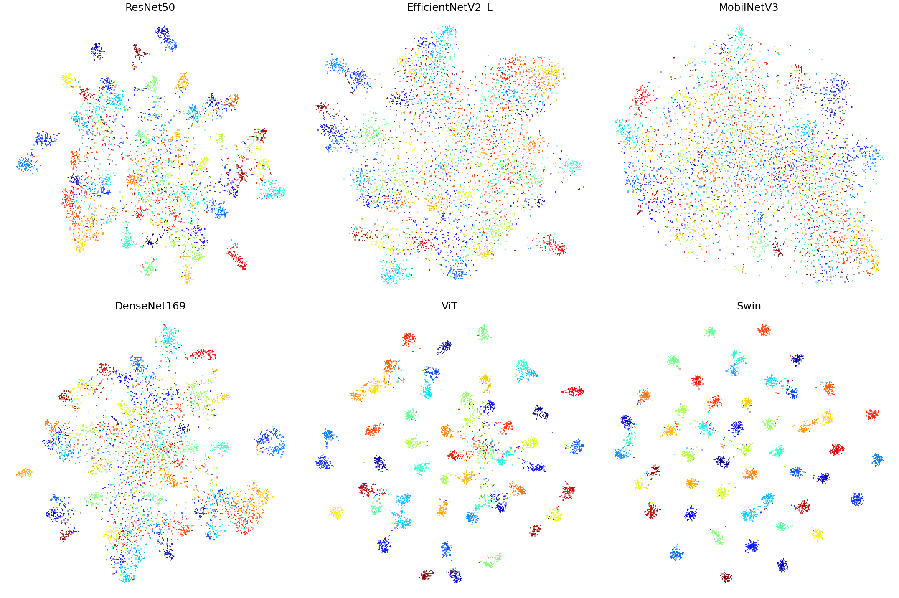
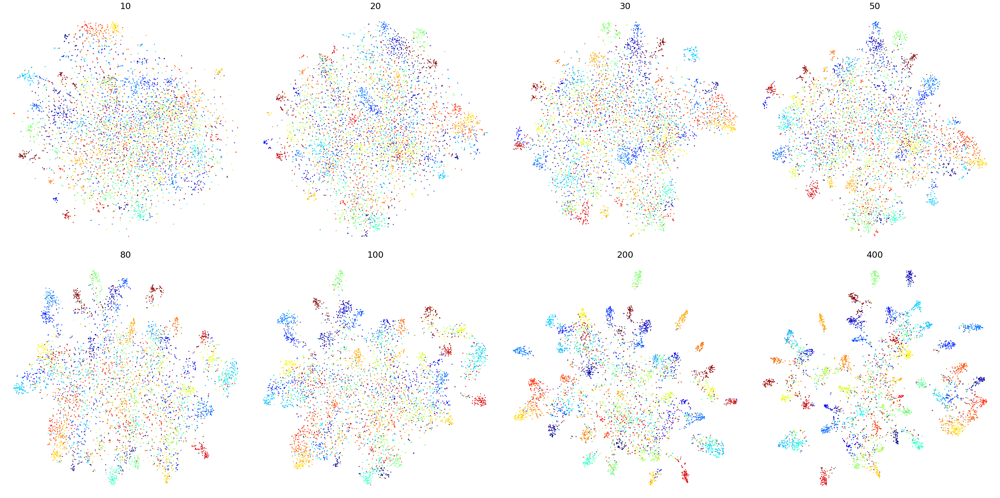
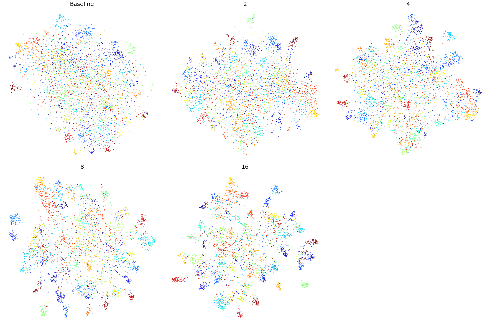
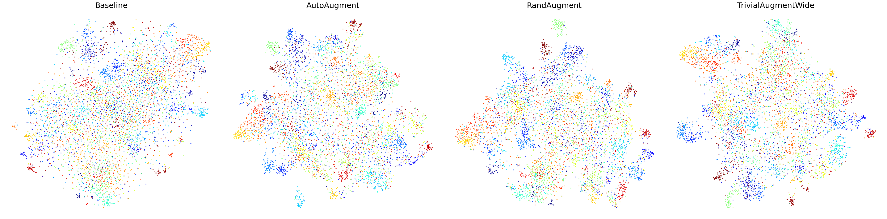

# Comparision-of-Deep-Image-Embedding-Methodes
This Repo compares different deep image embedding methods with the goal to achieve good general embeddings for images given a small amount of training data.

## Datasets
Following datasets were used:

- [Tiny ImageNet](https://www.kaggle.com/c/tiny-imagenet) ([Download](http://cs231n.stanford.edu/tiny-imagenet-200.zip)) for comparing the different embedding methods.
- [Internal and External Parts of Cars](https://www.kaggle.com/datasets/hamedahangari/internal-and-external-parts-of-cars) for the final test set.

The notebooks expect the datasets to be in the root of the repo.

## Backbones
The [Backbones](Backbones.ipynb)-Notebook compares the following backbones.

Results:

| Backbone  |  F1-Score|
|---|---|
|ResNet50   |  0.664 |
|EfficientNetV2_L   | 0.540  | 
|MobilNetV3   | 0.367   |
|DenseNet169   | 0.612   |
|ViT    | 0.893   |
|Swin    | 0.934   |

## Losses
The [Losses](Losses.ipynb)-Notebook compares the following Loss-Functions.

Results:

| Loss  |  F1-Score|
|---|---|
|ContrastiveLoss   |  0.650 |
|TripletLoss    | 0.660  | 
|SupConLoss    | 0.709   |
|SNRLoss    | 0.685   |
|NTXentLoss     | 0.618   |

## Embedding Size
The [Embedding Size](EmbeddingSize.ipynb)-Notebook compares different Embedding-Sizes.

Results:

| Embedding Size  |  F1-Score|
|---|---|
|64 |  0.654 |
|128     | 0.683 | 
|256     | 0.712   |
|512     | 0.719   |
|1024      | 0.724   |
|2048       | 0.731   |

## Dataset Size
The [Dataset Size](DatasetSize.ipynb)-Notebook compares different Train-Sample-Sizes for each class in the dataset.

Results:

| Samples per Class  |  F1-Score|
|---|---|
|10  |  0.223 |
|20      | 0.280 | 
|30      | 0.369   |
|50      | 0.443   |
|80       | 0.507   |
|100        | 0.520   |
|200        | 0.632   |
|400       | 0.703   |

## Augmentation Factor
The [Augmentation Factor](AugmentationSize.ipynb)-Notebook compares different augmentation factors for a small dataset with 20 images per class.

Results:

| Factor  |  F1-Score|
|---|---|
|1x (Baseline) |  0.306 |
|2x      | 0.352 | 
|4x      | 0.437   |
|8x      | 0.518   |
|16x       | 0.569  |

## Augmentation Methods
The [Augmentation Methods](AugmentationMethods.ipynb)-Notebook compares different auto-augmentation methods integrated in pytorch.

Results:

| Method  |  F1-Score|
|---|---|
|Baseline |  0.289 |
|AutoAugment  | 0.392  | 
|RandAugment  | 0.436   |
|TrivialAugmentWide  | 0.441   |

# Zero Shot Learning
In the [Zero Shot](ZeroShot.ipynb)-Notebook we test the capabilities of a SWIN-Network finetuned on the "Tiny-ImageNet"-Dataset to embed images from the "Internal and External Parts of Cars"-Dataset.

Results:

|  F1-Score|
|---|
| 0.865 |

# Putting it all together
In the [Final](Putting_It_All_Together.ipynb)-Notebook we try to finetune a Network on 20 images of 4 classes of the "Internal and External Parts of Cars"-Dataset and perform normal and zero-shot detection on all 8 classes with 230 images per class.

Results:

| Mode |F1-Score|
|---|---|
|Normal | 0.995 |
|Zero-Shot | 0.975 |

